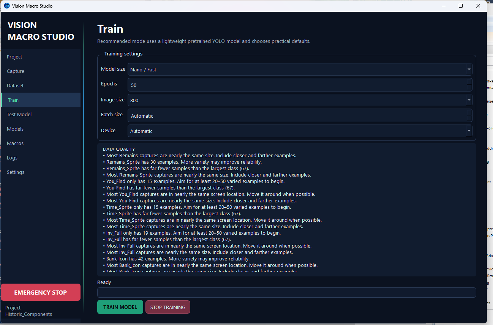

<p align="center">
  
</p>

<h1 align="center">Vision Macro Studio</h1>

<p align="center">
  A GUI-first Windows application for capturing screen objects, training a YOLO detector, testing models, and using detected objects in visual macros.
</p>

<p align="center">
  <strong>Current version: 0.2.0</strong> · <a href="CHANGELOG.md">Changelog</a> · <a href="LICENSE">MIT License</a>
</p>



## What it does

Vision Macro Studio turns visible screen elements into reusable automation targets:

**Capture → Label → Train → Test → Accept → Automate**

Instead of relying only on fixed coordinates, a macro can wait for an object, click the first available object from a priority list, branch when different messages appear, repeat steps, and safely stop after a chosen time.

The application uses:

- **PySide6** for the desktop interface
- **MSS and Pillow** for screen capture
- **Ultralytics YOLO and PyTorch** for object detection
- **pynput** for global hotkeys and mouse/keyboard automation

> [!IMPORTANT]
> Vision Macro Studio is an experimental Windows-first project. Automated input can reach the wrong window when the screen changes. Test macros one step at a time and keep the emergency-stop hotkey available.

## Highlights

| Area | Capabilities |
| --- | --- |
| Capture | Global-hotkey capture, multi-monitor support, multiple labeled boxes per screenshot |
| Dataset | Class management, assisted labeling, capture preview, train/validation splitting, quality dashboard, and near-duplicate detection |
| Training | Nano/Small/Medium YOLO fine-tuning, CPU/GPU selection, model lineage, training from an existing model, per-class metrics, and saved reports |
| Testing | Saved-image and live-screen inference with confidence, FPS, and timing feedback |
| Models | Versioned library with explicit acceptance, notes, overall/per-class comparisons, best-score identification, and confusion/training reports |
| Macros | Connected flow view, variables, counters, reusable submacros, failure branches, named steps, sections, drag reordering, validation, stable detection, and portable coordinates |
| Usability | Safe step debugger, one-loop runs, coordinate picker, destination-safe editing, import/exportable macro JSON, compact status overlay, detailed logs, and per-macro run limit |
| Safety | F12 emergency stop, interruptible waits and mouse travel, and automatic input release |

## Quick start on Windows

### Requirements

- 64-bit Windows 10 or Windows 11
- 64-bit Python 3.10 or newer
- Several gigabytes of free space for PyTorch, models, and training output

### Automatic setup

1. Clone this repository with GitHub Desktop, or download and extract the source ZIP.
2. Double-click `run_app.bat`.
3. The first launch creates a private `.venv` and installs the required packages.
4. Later launches reuse that environment.

PyTorch and PySide6 are large, so the first setup can take several minutes.

### Manual PowerShell setup

If Windows prevents the batch file from running, open PowerShell in the repository folder and run:

```powershell
py -m venv .venv
& ".\.venv\Scripts\python.exe" -m pip install --upgrade pip
& ".\.venv\Scripts\python.exe" -m pip install -r requirements.txt
& ".\.venv\Scripts\python.exe" -m app.main
```

Do not disable Windows security protections simply to run this project. Source builds and portable builds are currently unsigned, so Smart App Control or an organizational application-control policy may still block a native dependency. A trusted code-signed distribution is the long-term solution.

## First project workflow

1. Open **Project**, select **New Project**, and give it a name.
2. Open **Capture**, place the target application on screen, and press **F8**.
3. Draw one or more boxes around objects, assign class names, and press **Enter** to save.
4. Repeat with varied positions, backgrounds, sizes, and appearances.
5. Open **Dataset**, review the captures, and run **Automatic Split**.
6. Open **Train** and begin with the recommended pretrained Nano model.
7. Use **Test Model** on saved images and a live monitor.
8. Select the strongest model in **Models** and choose **Accept Model**.
9. Build and test a macro from the **Macros** page.

## Training from an existing model

The **Start from** list includes the pretrained YOLO base and every model saved in the open project. Selecting an existing model loads its learned weights and fine-tunes them against the complete current dataset.

Refinement creates a new candidate model rather than overwriting the earlier one. The Models page records its starting point, allowing experiments with shorter refinement runs while preserving a known-good version.

## Visual macro actions

- **Click First Available** checks object names in priority order and clicks the first match.
- **Wait For Any Object** watches several classes in one pass and can send each match to a different step.
- **Click Object** and **Right Click Object** target a configurable position inside a detected box.
- **Go To Step** and **Repeat** support intentional loops and capped repetition.
- **Wait** and detection timeouts support randomized minimum/maximum durations.
- **Click**, **Double Click**, **Right Click**, and **Move Mouse** support absolute or portable relative positions and optional random pixel offsets.
- **Press Key** and **Type Text** provide keyboard actions.
- **Wait Until Disappears** can pause until a visual state clears.
- **Section** adds a colored organizational divider and never sends input.
- **Set Variable** stores a number, true/false value, or text for the current run.
- **Add Variable** increments or decrements a numeric counter.
- **If Variable** compares a saved value and follows separate true and false routes.
- **Call Macro** runs another project macro as a reusable subroutine and then returns.

Detection steps can set **If timeout** to Stop, Continue, or Go to Step. The last option creates an explicit failure branch for missing objects, exhausted check limits, or timed-out waits.

Coordinate actions include **Pick by Click** and **Pick by Hover** tools. Always use Safe Step Preview after moving a macro to another computer.

## Builder quality of life

Every step can have a readable name and comment. Names appear in the builder, live log, and compact overlay, while comments remain visible in the row and Safe Step Preview. **Add Section** inserts a colored divider after the selected row so gathering, waiting, banking, and looping phases remain easy to scan.

Macro rows can be dragged into a new order. Move Up, Move Down, Duplicate, Add Section, and drag-to-reorder automatically recalculate numbered branch destinations so they continue targeting the same logical steps. If a referenced step is deleted, its route is deliberately marked invalid instead of silently redirecting to an unrelated row.

Choose **Validate Macro** to check:

- missing or disabled destination steps
- object names absent from the current project
- unreachable enabled steps
- detection steps that can wait forever
- closed loops without an exit or macro time limit
- missing, invalid, or recursive reusable-macro calls
- variables that are checked but never assigned

Validation errors block full and one-loop runs until repaired. Warnings remain advisory, and **Run Selected Step** stays available for focused troubleshooting. Double-click a validation issue to return directly to its row.

## Visual flow, variables, and reusable macros

Choose **Flow View** to open a connected overview of the current macro. Normal movement, detected-object matches, true/false conditions, timeout routes, jumps, repeats, and submacro returns use distinct labeled colors. The flow view is read-only; edit or drag the corresponding rows in the builder.

Variables reset when a macro run starts and are shared with every called submacro during that run. A common counter pattern is:

1. Set `completed_runs` to `0`.
2. Perform the repeated work.
3. Add `1` to `completed_runs`.
4. If `completed_runs >= 5`, branch to banking; otherwise branch back to gathering.

Import [examples/counter-submacro.vmsmacro.json](examples/counter-submacro.vmsmacro.json)
for a ready-made, input-free example. Its reusable dependency is bundled into the
same macro file and is imported automatically.

A reusable macro is an ordinary macro designed to finish at the end of its step list. Add **Call Macro** to a parent macro, select the reusable macro, and execution returns to the next parent step when it finishes. A Stop action inside a submacro stops the entire run. Direct and indirect recursive calls are rejected by validation and protected at runtime.

## Training assistant

On **Dataset**, select a saved screenshot and choose **Suggest Labels**. The accepted model proposes additional boxes above the selected confidence. Boxes that overlap an existing annotation of the same class are removed automatically. Review the preview, uncheck mistakes, and choose Apply; no annotation is changed before approval.

Choose **Quality Dashboard** for per-class instances, training/validation image coverage, average box size, position spread, and targeted recommendations. Its Near Duplicates tab identifies visually similar captures for review but never deletes them.

New v0.2.0 training runs save overall and per-class mAP50/mAP50-95 plus available Ultralytics confusion matrices and training curves. On **Models**, choose **Compare Models** for a side-by-side view, **Edit Notes** to record strengths or changes, and **View Training Report** for saved plots. The highest overall mAP50 is marked informationally without changing the accepted model.

## Regions and portable coordinates

Each macro can use the full selected **Watch** source or a smaller detection region. Choose **Draw Region**, drag around the useful portion of the screen, and release to save it. Detection then captures and analyzes only that area. The region is stored as percentages of the Watch source, so it follows resolution changes instead of preserving one fixed pixel rectangle. **Use Full Source** removes the crop.

Fixed mouse steps provide three coordinate bases:

- **Absolute screen position** preserves the existing X/Y behavior.
- **Watch source** stores horizontal and vertical percentages and recalculates the point for the Watch source's current position and resolution.
- **Application window** records the window underneath the picker and stores a percentage position inside it. At runtime, the coordinate follows that window when it moves or resizes.

Application-window coordinates identify a visible, non-minimized window by its saved title and Windows window class. They do not activate, restore, or uncover that window. Safe-preview the red target marker with the intended application visible before allowing live input.

Existing macros remain unchanged: they use the complete Watch source and absolute screen coordinates until the new options are selected.

## Detection stability

Every detection-based step can require more than one consecutive matching screen check before it passes. This helps reject a label that appears for only one frame. A step may also set a maximum number of detection checks; zero means no check-count limit, so its normal time-based timeout remains in control.

Detected-object click steps add two safeguards:

- **Clicked-object cooldown** temporarily ignores the same class near the same screen position after a click.
- **Wait until the clicked object disappears** holds the current step after clicking, with its own optional timeout, before the macro continues.

Existing macros retain their prior behavior: one confirmation, no maximum check count, no cooldown, and no post-click wait. A practical starting point for an unreliable visual message is two consecutive confirmations. For an object that remains visible briefly after a click, try a three-to-five-second cooldown or enable the disappearance wait.

## Macro debugger

Select any macro row and choose **Safe Step Preview**. The app temporarily minimizes and captures the selected Watch source after three seconds, without sending mouse or keyboard input. Detection steps show every model result at 5% confidence or higher, the active threshold, accepted or rejected targets, and the branch that would be taken. Coordinate and detected-object click steps show a red target marker. Because this preview captures only one frame, a step using consecutive confirmations reports the current result as confirmation 1 rather than pretending the full live condition passed.

**Run Selected Step** remains a live test and can send its configured input. **Run One Loop** runs normally until the macro finishes or would return to step 1. The Macro Builder keeps the most recent live decision visible after the run ends.

An importable, coordinate-free example is available at [`examples/priority-branch-loop.vmsmacro.json`](examples/priority-branch-loop.vmsmacro.json).

## Sharing macros

The Macro Builder exports versioned `.vmsmacro.json` files containing the macro steps, object names, timing, detection region, coordinate bases, offsets, monitor choice, and time limit. Models, screenshots, and dataset images are not included.

Version 0.2.0 exports macro format version 3 and continues importing formats 1 and 2. When a macro calls reusable macros, those dependencies are included recursively in the exported file and added during import. Models, screenshots, and datasets remain separate.

Imported macros are validated before being added. The application warns about missing object classes, unavailable monitors, and coordinates that may need verification on a different display layout.

## Status overlay and run limits

The optional always-on-top overlay displays only two lines: the current numbered step and the latest detection result with confidence. It can be dragged anywhere on the screen and remembers its position.

Each macro can also have a **Stop after** time in minutes. A positive limit interrupts detection polling, randomized waits, mouse travel, and continuous loops when the time expires.

## Default hotkeys

| Action | Default |
| --- | --- |
| Capture object | F8 |
| Start coordinate recording | F6 |
| Stop coordinate recording | F7 |
| Run selected macro | F9 |
| Emergency stop | F12 |

Hotkeys can be changed in **Settings**.

## Project data and privacy

Captures, labels, models, logs, macros, and project settings remain inside the project folder selected by the user. Captures may contain private information that was visible on screen, so review project contents before sharing or exporting them.

This repository intentionally excludes:

- Python virtual environments
- User projects and settings
- Captured screenshots and datasets
- Trained model weights
- Logs and training runs
- PyInstaller and portable-build output

## Development and verification

Run the dependency-light smoke test from the repository root:

```powershell
py tests\smoke_test.py
```

The smoke test covers project persistence, assisted annotations, dataset analysis, model metrics, macro variables, flow edges, bundled submacros, failure branches, stability, regions, portable coordinates, destination-preserving edits, validation, and project ZIP export/import.

To check every Python module for syntax errors:

```powershell
py -m compileall app tests tools
```

## Build a portable Windows edition

The portable builder must run on 64-bit Windows from a Python environment that can already open the application:

```powershell
& ".\.venv\Scripts\python.exe" tools\build_windows_portable.py --no-prompt
```

The builder installs PyInstaller when necessary, creates a one-folder Windows application, runs a packaged self-test, and writes:

`release\VisionMacroStudio-Portable-v0.2.0.zip`

The package may exceed 1 GB because it contains Python, Qt, OpenCV, PyTorch, Torchvision, and Ultralytics. The resulting binaries are unsigned and may be blocked by Smart App Control. GitHub hosting does not itself establish publisher trust.

## Current limitations

- Detection regions are configured per macro rather than separately for each detection step.
- Window-relative coordinates do not bring a covered or minimized target window to the foreground.
- The connected macro flow view is read-only; editing remains in the draggable row builder.
- The input recorder stores clicks, key presses, and delays rather than every raw mouse movement.
- Per-class comparisons and saved training reports are available only for models trained with v0.2.0 or newer.
- Suggested labels require an accepted model and still need human review; the assistant never retrains or accepts suggestions automatically.
- GPU acceleration requires compatible NVIDIA hardware and a supported PyTorch installation.

## Contributing

Bug reports, reproducible test cases, documentation improvements, and focused pull requests are welcome. Please avoid attaching private screen captures, trained models, game account information, credentials, or other personal project data to public issues.

## Responsible use

Use Vision Macro Studio only where automation is allowed. Do not use it to bypass access controls, anti-cheat systems, service rules, or other safeguards. The application does not include stealth or background-evasion features.

## License

Vision Macro Studio is available under the [MIT License](LICENSE). Copyright © 2026 Dillard Watkins.
